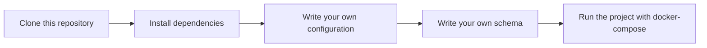

# Eavesdropper
Eavesdropper is project that used for consuming in message queue and storing in database.


## Features
- Consume message from Nats
- Store message in timescaleDB


## How does eavesdropper work?
Eavesdropper configure message queue and database with input data from config file.
After that, eavesdropper will parse schema file to understand the structure of message.
Then, eavesdropper will consume message from message queue and store it in database.  
Eavesdropper will create table in database with migration files and create column in table with name of message queue's field.


### What is schema file?
Schema file is a file that used for understanding the structure of message. It's contain two parts:
- Subject (required)
- Storage (required)


#### Subject
Subject is a topic that message queue should consume on it.

#### Storage
Storage is a metadata of example message that received from message queue. It's contain list of two parts:
- Table (required)
- Field To DB Column (required)

##### Table
Table name is a name of table that message should store in it for selected subject.

##### Field To DB Column
Field To DB Column is a list of field that message queue should store in database. It's a dictionary that key is 
name of field in message and value is name of column in database.

##### NOTE: You can define multiple subject in one schema file! Also, You can store fields of message in multiple table. Check example below.
````yaml
- subject: "test-subject-1"
  storage:
    - table: "test_one"
      field_to_db_column:
        data: "data"
        status: "state"

- subject: "test-subject-2"
  storage:
    - table: "test_two"
      field_to_db_column:
        var1: "var_one"
        var2: "status"
    - table: "test_three"
      field_to_db_column:
        var1: "var_one"
        var3: "var_three"
````
In this example, Eavesdropper has three table in database with name of test_one and test_two. It's store data of message that received from test-subject-1 and test-subject-2.
In "test-subject-2" topic, Eavesdropper store data of message in two table. var1 and var2 store in `test_two` and
var1 and var3 store in `test_three`. 


## How to run locally?
After cloning the project, you can run it locally by using the following commands:

```bash
make mod
make build-eavesdropper
docker-compose -f docker-compose.dev.yaml up -d
eavesdropper --config config.yaml
```


## Usage
1) Clone this repository
2) Install dependencies
3) Write your own configuration
4) Write your own schema
5) Run the project with docker-compose



## License

[MIT](https://choosealicense.com/licenses/mit/)


## Authors

- [@n25a](https://www.github.com/n25a)


## todo
* [X] GitHub actions
* [X] app package
* [X] DSN
* [X] CLI
* [X] license
* [X] security
* [X] issue templates
* [X] feature templates
* [X] pull request templates
* [X] gitignore
* [X] query builder
* [X] logger
* [X] config file
* [X] dockerized
* [X] makefile
* [X] godoc
* [X] readme
* [ ] test
* [ ] Nats config
* [ ] helm
* [ ] changelog
* [ ] release
* [ ] contributing
