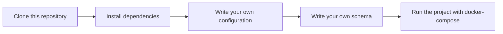

# Eavesdropper
Eavesdropper is project that used for consuming in message queue and storing in database.


## Features
- Consume message from Nats
- Store message in timescaleDB


## How does eavesdropper work?
Eavesdropper configure message queue and database with input data from config file.
After that, eavesdropper will parse schema file to understand the structure of message.
Then, eavesdropper will consume message from message queue and store it in database.  
Eavesdropper will create table in database with migration files and create column in table with name of message queue's field.


### What is schema file?
Schema file is a file that used for understanding the structure of message. It's contain three parts:
- Subject (required)
- Table name (required)
- Data (required)


#### Subject
Subject is a topic that message queue should consume on it.

#### Table name
Table name is a name of table that message should store in it for selected subject.

#### Data
Data is a json example of message that received from message queue.

##### NOTE: You can define multiple subject in one schema file! Check example below.
````yaml
- subject: "test-subject-1"
  table: "test_one"
  data: |
    "{ "data" : 12, "status" : "OK" }"
- subject: "test-subject-2"
  table: "test_two"
  data: |
    "{ "var1" : "example", "var2" : "OK", "var3" : 45.6 }"
````

## How to run locally?
After cloning the project, you can run it locally by using the following commands:

```bash
make mod
make build-eavesdropper
docker-compose -f docker-compose.dev.yaml up -d
eavesdropper --config config.yaml
```


## Usage
1) Clone this repository
2) Install dependencies
3) Write your own configuration
4) Write your own schema
5) Run the project with docker-compose



## License

[MIT](https://choosealicense.com/licenses/mit/)


## Authors

- [@n25a](https://www.github.com/n25a)


## todo
* [X] GitHub actions
* [X] app package
* [X] DSN
* [X] CLI
* [X] license
* [X] security
* [X] issue templates
* [X] feature templates
* [X] pull request templates
* [X] gitignore
* [X] query builder
* [X] logger
* [X] config file
* [X] dockerized
* [X] makefile
* [X] godoc
* [X] readme
* [ ] test
* [ ] Nats config
* [ ] helm
* [ ] changelog
* [ ] release
* [ ] contributing
