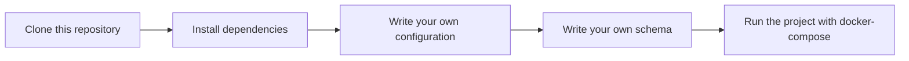

# eavesdropper
Eavesdropper is project that used for consuming in message queue and storing in database.

## Features
- Consume message from Nats
- Store message in timescaleDB

## Usage
1) Clone this repository
2) Install dependencies
3) Write your own configuration
4) Write your own schema
5) Run the project with docker-compose

## License

[MIT](https://choosealicense.com/licenses/mit/)

## Authors

- [@n25a](https://www.github.com/n25a)

## todo
* [X] GitHub actions
* [X] app package
* [X] DSN
* [X] CLI
* [X] license
* [X] security
* [X] issue templates
* [X] feature templates
* [X] pull request templates
* [X] gitignore
* [X] query builder
* [X] logger
* [X] config file
* [X] dockerized
* [X] makefile
* [X] godoc
* [X] readme
* [ ] test
* [ ] Nats config
* [ ] helm
* [ ] changelog
* [ ] release
* [ ] contributing
